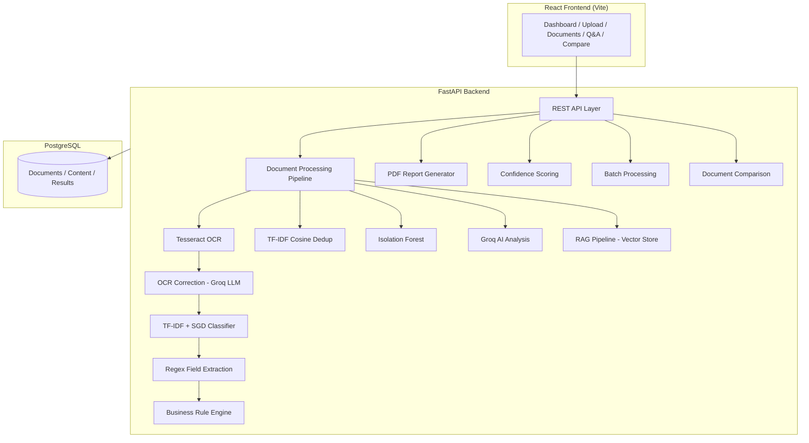

# Documind — Intelligent Document Processing Platform

> Enterprise-grade document intelligence: OCR extraction, ML classification, field validation, anomaly detection, duplicate analysis, RAG-powered Q&A, and automated PDF reporting.

---

## Architecture



---

## Features

| Feature | Description |
|---------|-------------|
| **OCR Extraction** | Tesseract engine with multi-page PDF/image support |
| **OCR Correction** | LLM-powered post-processing to fix OCR artifacts |
| **ML Classification** | TF-IDF + SGD model classifies documents (Invoice, Receipt, Contract, Resume) |
| **Field Extraction** | Deterministic regex extraction of dates, amounts, vendor names, IDs |
| **Validation** | 6 business rules validate arithmetic, dates, mandatory fields |
| **Duplicate Detection** | TF-IDF cosine similarity + SHA-256 hash matching |
| **Anomaly Detection** | Isolation Forest flags statistical outliers |
| **AI Semantic Analysis** | Groq LLM generates summaries, entities, risk narratives |
| **RAG Q&A** | Page-aware chunking + vector retrieval + LLM-grounded answers |
| **Document Comparison** | Side-by-side field diffs, similarity score, validation comparison |
| **Confidence Scoring** | Weighted aggregate of classification, extraction, validation confidence |
| **PDF Reports** | Auto-generated branded PDF reports with all analysis results |
| **Batch Processing** | Upload and process up to 20 documents in a single batch |
| **Docker Support** | Full containerization with PostgreSQL, backend, and frontend |

---

## Quick Start

### Prerequisites

- Python 3.12+
- Node.js 20+
- PostgreSQL 14+
- Tesseract OCR installed and on PATH

### Backend Setup

```bash
cd backend

# Create virtual environment
python -m venv venv
source venv/bin/activate  # or venv\Scripts\activate on Windows

# Install dependencies
pip install -r requirements.txt
pip install fpdf2

# Configure environment
cp .env.example .env
# Edit .env with your DATABASE_URL and optional GROQ_API_KEY

# Run database migrations
alembic upgrade head

# Start server
uvicorn app.main:app --reload --port 8000
```

### Frontend Setup

```bash
cd frontend

# Install dependencies
npm install

# Start dev server
npm run dev
```

### Docker Deployment

```bash
# Copy and configure environment
cp .env.docker .env

# Build and start all services
docker-compose up --build -d

# Access the application
# Frontend: http://localhost
# Backend API: http://localhost:8000
```

---

## Environment Variables

| Variable | Required | Default | Description |
|----------|----------|---------|-------------|
| `DATABASE_URL` | Yes | — | PostgreSQL connection string |
| `GROQ_API_KEY` | No | — | Groq API key for AI analysis & OCR correction |
| `GROQ_MODEL` | No | `qwen/qwen3.8-27b` | LLM model identifier |
| `TESSERACT_CMD` | No | `tesseract` | Path to Tesseract binary |
| `UPLOAD_DIR` | No | `uploads` | Directory for uploaded files |
| `MAX_FILE_SIZE` | No | `10485760` | Max upload size in bytes (10 MB) |
| `ANOMALY_CONTAMINATION` | No | `0.05` | Isolation Forest contamination factor |
| `DEBUG` | No | `true` | Enable debug logging |

---

## API Endpoints

### Documents
| Method | Endpoint | Description |
|--------|----------|-------------|
| `POST` | `/api/documents/upload` | Upload single document |
| `POST` | `/api/documents/upload/batch` | Upload multiple documents (batch) |
| `GET` | `/api/documents` | List all documents |
| `GET` | `/api/documents/{id}` | Get document details |
| `DELETE` | `/api/documents/{id}` | Delete a document |
| `POST` | `/api/documents/{id}/process` | Trigger processing |

### Analysis
| Method | Endpoint | Description |
|--------|----------|-------------|
| `GET` | `/api/documents/{id}/analysis` | Full analysis results |
| `GET` | `/api/documents/{id}/content` | Extracted text content |
| `GET` | `/api/documents/{id}/validation` | Validation results |
| `GET` | `/api/documents/{id}/duplicates` | Duplicate check |
| `GET` | `/api/documents/{id}/anomaly` | Anomaly detection |
| `GET` | `/api/documents/{id}/confidence` | Confidence scores |

### Intelligence
| Method | Endpoint | Description |
|--------|----------|-------------|
| `POST` | `/api/documents/{id}/qa` | Ask question about a document |
| `POST` | `/api/documents/qa` | Ask across all documents |
| `POST` | `/api/documents/compare` | Compare two documents |
| `GET` | `/api/documents/{id}/report` | Download PDF report |

### Batch Processing
| Method | Endpoint | Description |
|--------|----------|-------------|
| `POST` | `/api/documents/upload/batch` | Upload batch (up to 20 files) |
| `GET` | `/api/documents/batch/{id}/status` | Poll batch status |

### System
| Method | Endpoint | Description |
|--------|----------|-------------|
| `GET` | `/health` | Health check |
| `GET` | `/api/documents/ai/status` | AI configuration status |
| `POST` | `/api/documents/ai/config` | Update AI API key |

---

## Project Structure

```
Documind/
├── backend/
│   ├── app/
│   │   ├── api/            # FastAPI route handlers
│   │   ├── anomaly/        # Isolation Forest anomaly detection
│   │   ├── core/           # Settings, logging
│   │   ├── database/       # SQLAlchemy session & base
│   │   ├── dedup/          # TF-IDF duplicate detection
│   │   ├── ml/             # ML models (classification, extraction, LayoutLM)
│   │   ├── models/         # SQLAlchemy ORM models
│   │   ├── processing/     # OCR pipeline, text cleaning, page storage
│   │   ├── rag/            # RAG: chunking, embeddings, vector store, LLM
│   │   ├── schemas/        # Pydantic request/response schemas
│   │   ├── services/       # Business logic services
│   │   ├── utils/          # Helpers
│   │   └── validation/     # Business rule engine
│   ├── alembic/            # Database migrations
│   ├── tests/              # Pytest test suite
│   ├── Dockerfile
│   └── requirements.txt
├── frontend/
│   ├── src/
│   │   ├── components/     # Reusable UI components
│   │   ├── pages/          # Route pages
│   │   ├── services/       # API client
│   │   └── hooks/          # React hooks
│   ├── Dockerfile
│   └── nginx.conf
├── docker-compose.yml
├── ml/                     # ML training artifacts
└── data/                   # Sample data
```

---

## Testing

```bash
cd backend

# Run all tests
python -m pytest tests/ -v

# Run specific test suite
python -m pytest tests/test_phase13.py -v    # Batch, OCR, Comparison
python -m pytest tests/test_rag.py -v        # RAG pipeline
python -m pytest tests/test_validation.py -v # Validation rules
```

---

## Troubleshooting

| Issue | Solution |
|-------|----------|
| Tesseract not found | Install Tesseract OCR and add to PATH |
| Database connection error | Verify `DATABASE_URL` and PostgreSQL is running |
| AI analysis returns fallback | Set `GROQ_API_KEY` in `.env` |
| Batch upload fails | Check file types (PDF, JPG, PNG, TIFF only) and max 20 files |
| PDF report error | Run `pip install fpdf2` |
| Docker build fails | Ensure Docker Desktop is running |

---

## License

MIT
