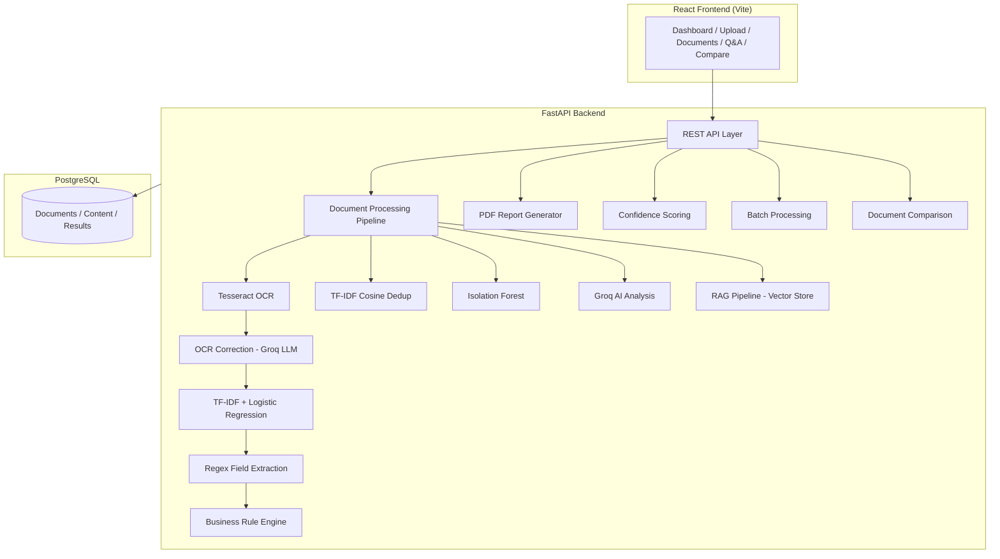

# Documind : Intelligent Document Processing Platform

> Enterprise-grade document intelligence: OCR extraction, ML classification, field validation, anomaly detection, duplicate analysis, RAG-powered Q&A, and automated PDF reporting.

---

## System Flow

```
                           ┌──────────────┐
                           │  User Upload │
                           │  (PDF/JPG/   │
                           │   PNG/TIFF)  │
                           └──────┬───────┘
                                  │
                                  ▼
                    ┌─────────────────────────────┐
                    │   1. OCR Text Extraction    │
                    │      (Tesseract v5.5.3)     │
                    └──────────────┬──────────────┘
                                  │
                                  ▼
                    ┌─────────────────────────────┐
                    │   2. OCR Error Correction   │
                    │      (Groq LLM / Regex)     │
                    └──────────────┬──────────────┘
                                  │
                                  ▼
                    ┌─────────────────────────────┐
                    │   3. ML Classification      │
                    │   TF-IDF + Logistic Reg.    │
                    │   (13 Financial Categories) │
                    └──────────────┬──────────────┘
                                  │
                    ┌─────────────┼─────────────┐
                    ▼             ▼             ▼
            ┌──────────┐  ┌──────────┐  ┌──────────┐
            │4. Field  │  │5. Biz    │  │6. Dedup  │
            │Extraction│  │Rule      │  │Detection │
            │(Regex)   │  │Validation│  │(Cosine)  │
            └────┬─────┘  └────┬─────┘  └────┬─────┘
                 │             │             │
                 └─────────────┼─────────────┘
                               ▼
                 ┌─────────────────────────────┐
                 │  7. Anomaly Detection       │
                 │     (Isolation Forest)      │
                 └──────────────┬──────────────┘
                               │
                 ┌─────────────┼─────────────┐
                 ▼             ▼             ▼
          ┌──────────┐  ┌──────────┐  ┌──────────┐
          │8. AI     │  │9. RAG    │  │10. PDF   │
          │Semantic  │  │Indexing  │  │Report    │
          │Analysis  │  │& Q&A     │  │Generator │
          │(Groq LLM)│  │(Vectors) │  │(FPDF2)   │
          └──────────┘  └──────────┘  └──────────┘
                               │
                               ▼
                    ┌─────────────────────────────┐
                    │     PostgreSQL Database     │
                    │  (Documents, Results, Index)│
                    └─────────────────────────────┘
```

---

## Architecture



---

## Features

| Feature | Description |
|---------|-------------|
| **OCR Extraction** | Tesseract engine with multi-page PDF/image support |
| **OCR Correction** | LLM-powered post-processing to fix OCR artifacts |
| **ML Classification** | TF-IDF + Logistic Regression — 13 categories, 99.78% accuracy |
| **Field Extraction** | Deterministic regex extraction of dates, amounts, vendor names, IDs |
| **Validation** | 6 business rules validate arithmetic, dates, mandatory fields |
| **Duplicate Detection** | TF-IDF cosine similarity + SHA-256 hash matching |
| **Anomaly Detection** | Isolation Forest flags statistical outliers |
| **AI Semantic Analysis** | Groq LLM generates summaries, entities, risk narratives |
| **RAG Q&A** | Page-aware chunking + vector retrieval + LLM-grounded answers |
| **Document Comparison** | Side-by-side field diffs, similarity score, validation comparison |
| **Confidence Scoring** | Weighted aggregate of classification, extraction, validation confidence |
| **PDF Reports** | Auto-generated branded PDF reports with all analysis results |
| **Batch Processing** | Upload and process up to 20 documents in a single batch |
| **Docker Support** | Full containerization with PostgreSQL, backend, and frontend |

---

## ML Models & Algorithms

### Model 1: Document Classifier (TF-IDF + Logistic Regression)

| Parameter | Value |
|-----------|-------|
| **Algorithm** | TF-IDF Vectorizer → Logistic Regression (OvR) |
| **Library** | scikit-learn |
| **Categories** | 13 financial document types |
| **Training Data** | 6,725 labeled text documents |
| **Train/Test Split** | 80/20 stratified |
| **Vocabulary** | 10,000 features (unigrams + bigrams) |

**Evaluation Metrics:**

| Metric | Score |
|--------|-------|
| Accuracy | **99.78%** |
| Precision (macro) | **99.77%** |
| Recall (macro) | **99.76%** |
| F1-Score (macro) | **99.76%** |

**Per-Class Accuracy:**

| Category | Test Samples | Correct | Accuracy |
|----------|-------------|---------|----------|
| audit_report | 100 | 100 | 100.0% |
| balance_sheet | 100 | 100 | 100.0% |
| bank_statement | 100 | 98 | 98.0% |
| cash_flow | 87 | 86 | 98.9% |
| check | 95 | 95 | 100.0% |
| insurance_policy | 120 | 120 | 100.0% |
| invoice | 120 | 120 | 100.0% |
| loan_agreement | 100 | 100 | 100.0% |
| other | 120 | 120 | 100.0% |
| profit_loss | 100 | 100 | 100.0% |
| purchase_order | 120 | 120 | 100.0% |
| salary_slip | 97 | 97 | 100.0% |
| tax_return | 86 | 86 | 100.0% |

> Only 3 misclassifications out of 1,345 test samples:
> - 2 bank statements → classified as checks
> - 1 cash flow → classified as balance sheet

### Model 2: Financial Heuristic Classifier

| Parameter | Value |
|-----------|-------|
| **Type** | Rule-based (regex + keyword scoring) |
| **Purpose** | Fallback when ML confidence < 50% |
| **Confidence** | 70-85% calibrated |

### Model 3: Anomaly Detection (Isolation Forest)

| Parameter | Value |
|-----------|-------|
| **Algorithm** | Isolation Forest |
| **Library** | scikit-learn |
| **Contamination** | 0.05 (5% expected anomalies) |
| **Purpose** | Flag statistical outliers in extracted fields |

### Model 4: Duplicate Detection (TF-IDF Cosine Similarity)

| Parameter | Value |
|-----------|-------|
| **Algorithm** | TF-IDF + Cosine Similarity |
| **Threshold** | Configurable (default 0.85) |
| **Secondary** | SHA-256 hash for exact matches |

### Model 5: AI Semantic Analysis (Groq LLM)

| Parameter | Value |
|-----------|-------|
| **Model** | Qwen 3.8-27B via Groq API |
| **Purpose** | Summaries, entity extraction, risk analysis |
| **Fallback** | Regex-based extraction when API unavailable |

### Model 6: RAG Pipeline (Retrieval-Augmented Generation)

| Parameter | Value |
|-----------|-------|
| **Chunking** | Page-aware text chunking |
| **Embeddings** | TF-IDF vector store |
| **Generation** | Groq LLM with grounded context |

---

## Training Data & Preprocessing

### Data Summary

| Category | Files | Source |
|----------|-------|--------|
| insurance_policy | 600 | Synthetic + CSV conversion |
| invoice | 600 | Existing labeled data |
| purchase_order | 600 | Existing labeled data |
| other | 600 | Existing labeled data |
| audit_report | 500 | Synthetic generation |
| balance_sheet | 500 | HTML parsing + Synthetic |
| bank_statement | 500 | OCR + CSV + Synthetic |
| loan_agreement | 500 | Synthetic generation |
| profit_loss | 500 | HTML parsing + Synthetic |
| salary_slip | 485 | OCR + Synthetic |
| check | 473 | OCR + Synthetic |
| cash_flow | 436 | HTML parsing + Synthetic |
| tax_return | 431 | OCR + Synthetic |
| **TOTAL** | **6,725** | |

### Data Sources

1. **Existing Data** — Pre-labeled text files from initial project development
2. **HTML Conversion** — SEC EDGAR financial HTML tables parsed with BeautifulSoup
3. **JPG OCR** — Scanned document images processed with Tesseract OCR v5.5.3
4. **CSV Conversion** — Tabular bank/insurance data converted to natural language text
5. **Synthetic Generation** — Python-generated samples using randomized Indian financial templates

### Preprocessing Pipeline

```
Raw Document → Lowercase → Whitespace Collapse → ASCII Filter → Truncate (2KB)
                                                                      ↓
                                                          OCR Noise Injection (3%)
                                                                      ↓
                                                          Class Balancing (cap/boost)
                                                                      ↓
                                                            data/classification/
                                                              ├── invoice/
                                                              ├── bank_statement/
                                                              └── ... (13 folders)
```

### Data Preparation Scripts

| Script | Purpose |
|--------|---------|
| `scripts/generate_training_data.py` | Generate synthetic: Insurance, Loan, Audit |
| `scripts/generate_lowcount_data.py` | Generate synthetic: Salary, Check, Cash Flow, Tax |
| `scripts/convert_raw_data.py` | Convert HTML/JPG/CSV → text |
| `scripts/balance_classes.py` | Balance classes (cap overrepresented, boost underrepresented) |

### Retraining Command

```bash
cd backend
python -m app.ml.classification.trainer --data-dir ../data/classification --output-dir app/ml/classification
```

---

## Quick Start

### Prerequisites

- Python 3.12+
- Node.js 20+
- PostgreSQL 14+
- Tesseract OCR installed and on PATH

### Backend Setup

```bash
cd backend

# Create virtual environment
python -m venv venv
source venv/bin/activate  # or venv\Scripts\activate on Windows

# Install dependencies
pip install -r requirements.txt
pip install fpdf2

# Configure environment
cp .env.example .env
# Edit .env with your DATABASE_URL and optional GROQ_API_KEY

# Run database migrations
alembic upgrade head

# Start server
uvicorn app.main:app --reload --port 8000
```

### Frontend Setup

```bash
cd frontend

# Install dependencies
npm install

# Start dev server
npm run dev
```

### Docker Deployment

```bash
# Copy and configure environment
cp .env.docker .env

# Build and start all services
docker-compose up --build -d

# Access the application
# Frontend: http://localhost
# Backend API: http://localhost:8000
```

---

## Environment Variables

| Variable | Required | Default | Description |
|----------|----------|---------|-------------|
| `DATABASE_URL` | Yes | — | PostgreSQL connection string |
| `GROQ_API_KEY` | No | — | Groq API key for AI analysis & OCR correction |
| `GROQ_MODEL` | No | `qwen/qwen3.8-27b` | LLM model identifier |
| `TESSERACT_CMD` | No | `tesseract` | Path to Tesseract binary |
| `UPLOAD_DIR` | No | `uploads` | Directory for uploaded files |
| `MAX_FILE_SIZE` | No | `10485760` | Max upload size in bytes (10 MB) |
| `ANOMALY_CONTAMINATION` | No | `0.05` | Isolation Forest contamination factor |
| `DEBUG` | No | `true` | Enable debug logging |

---

## API Endpoints

### Documents
| Method | Endpoint | Description |
|--------|----------|-------------|
| `POST` | `/api/documents/upload` | Upload single document |
| `POST` | `/api/documents/upload/batch` | Upload multiple documents (batch) |
| `GET` | `/api/documents` | List all documents |
| `GET` | `/api/documents/{id}` | Get document details |
| `DELETE` | `/api/documents/{id}` | Delete a document |
| `POST` | `/api/documents/{id}/process` | Trigger processing |

### Analysis
| Method | Endpoint | Description |
|--------|----------|-------------|
| `GET` | `/api/documents/{id}/analysis` | Full analysis results |
| `GET` | `/api/documents/{id}/content` | Extracted text content |
| `GET` | `/api/documents/{id}/validation` | Validation results |
| `GET` | `/api/documents/{id}/duplicates` | Duplicate check |
| `GET` | `/api/documents/{id}/anomaly` | Anomaly detection |
| `GET` | `/api/documents/{id}/confidence` | Confidence scores |

### Intelligence
| Method | Endpoint | Description |
|--------|----------|-------------|
| `POST` | `/api/documents/{id}/qa` | Ask question about a document |
| `POST` | `/api/documents/qa` | Ask across all documents |
| `POST` | `/api/documents/compare` | Compare two documents |
| `GET` | `/api/documents/{id}/report` | Download PDF report |

### Batch Processing
| Method | Endpoint | Description |
|--------|----------|-------------|
| `POST` | `/api/documents/upload/batch` | Upload batch (up to 20 files) |
| `GET` | `/api/documents/batch/{id}/status` | Poll batch status |

### System
| Method | Endpoint | Description |
|--------|----------|-------------|
| `GET` | `/health` | Health check |
| `GET` | `/api/documents/ai/status` | AI configuration status |
| `POST` | `/api/documents/ai/config` | Update AI API key |

---

## Project Structure

```
Documind/
├── backend/
│   ├── app/
│   │   ├── api/            # FastAPI route handlers
│   │   ├── anomaly/        # Isolation Forest anomaly detection
│   │   ├── core/           # Settings, logging
│   │   ├── database/       # SQLAlchemy session & base
│   │   ├── dedup/          # TF-IDF duplicate detection
│   │   ├── ml/             # ML models & classification
│   │   │   ├── classification/
│   │   │   │   ├── trainer.py          # Training pipeline
│   │   │   │   ├── heuristics.py       # Heuristic fallback
│   │   │   │   ├── classifier.joblib   # Trained model
│   │   │   │   ├── vectorizer.joblib   # TF-IDF vectorizer
│   │   │   │   └── metadata.json       # Training metrics
│   │   │   ├── extraction/             # Field extractors
│   │   │   └── classifier.py           # ML classifier wrapper
│   │   ├── models/         # SQLAlchemy ORM models
│   │   ├── processing/     # OCR pipeline, text cleaning
│   │   ├── rag/            # RAG: chunking, embeddings, LLM
│   │   ├── schemas/        # Pydantic schemas
│   │   ├── services/       # Business logic
│   │   └── validation/     # Business rule engine
│   ├── alembic/            # Database migrations
│   ├── tests/              # Pytest test suite
│   └── requirements.txt
├── frontend/
│   ├── src/
│   │   ├── components/     # Reusable UI components
│   │   ├── pages/          # Route pages
│   │   ├── services/       # API client
│   │   └── hooks/          # React hooks
│   └── nginx.conf
├── data/
│   ├── classification/     # Training data (13 category folders)
│   ├── Balance Sheets/     # Raw HTML financial data
│   ├── Bank Statement/     # Raw JPG scanned documents
│   └── *.csv               # Tabular data sources
├── scripts/                # Data generation & conversion scripts
├── docker-compose.yml
└── PROJECT_DOCUMENTATION.txt
```

---

## Testing

```bash
cd backend

# Run all tests
python -m pytest tests/ -v

# Run specific test suite
python -m pytest tests/test_phase13.py -v    # Batch, OCR, Comparison
python -m pytest tests/test_rag.py -v        # RAG pipeline
python -m pytest tests/test_validation.py -v # Validation rules
```

---

## Troubleshooting

| Issue | Solution |
|-------|----------|
| Tesseract not found | Install Tesseract OCR and add to PATH |
| Database connection error | Verify `DATABASE_URL` and PostgreSQL is running |
| AI analysis returns fallback | Set `GROQ_API_KEY` in `.env` |
| Batch upload fails | Check file types (PDF, JPG, PNG, TIFF only) and max 20 files |
| PDF report error | Run `pip install fpdf2` |
| Docker build fails | Ensure Docker Desktop is running |
| Model accuracy low | Re-balance data with `scripts/balance_classes.py` and retrain |

---

## License

MIT
